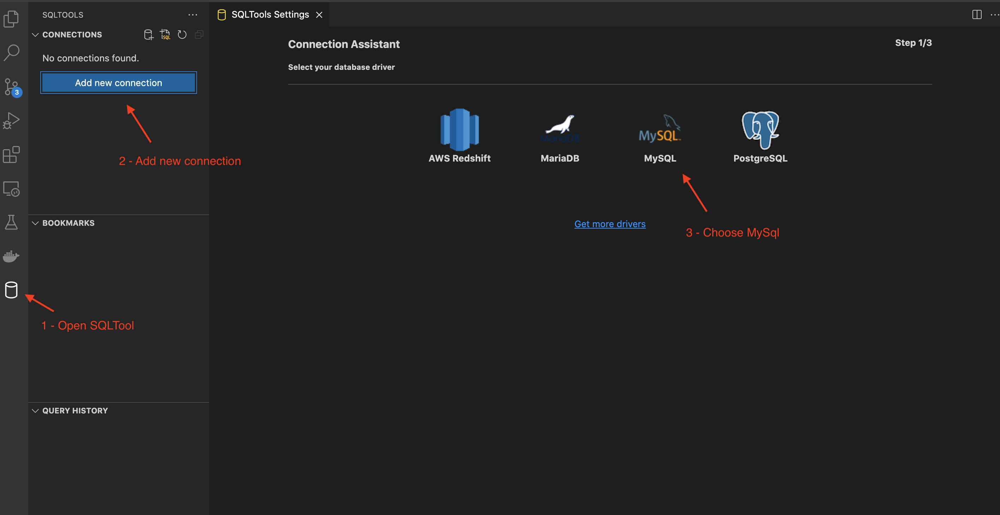
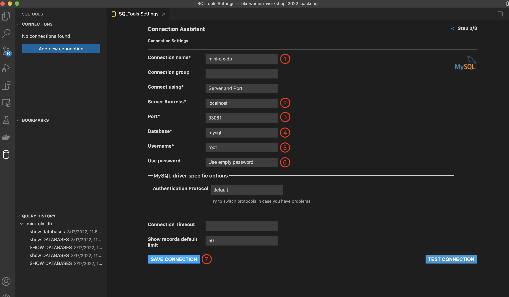
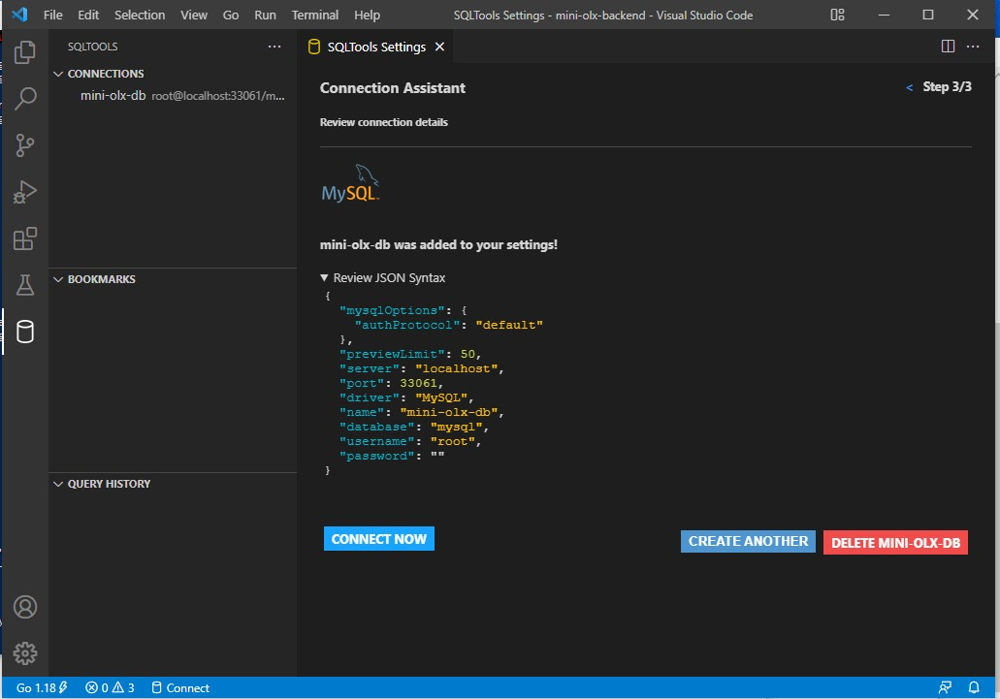
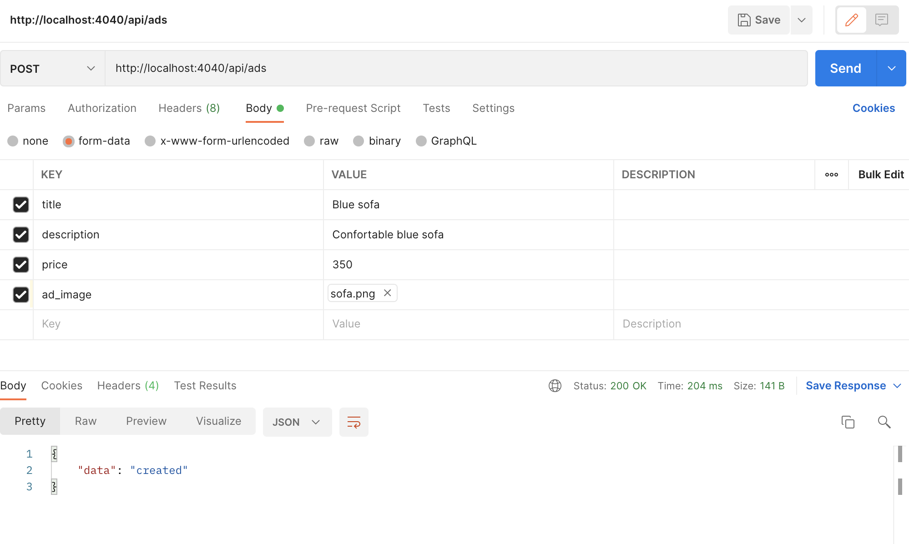
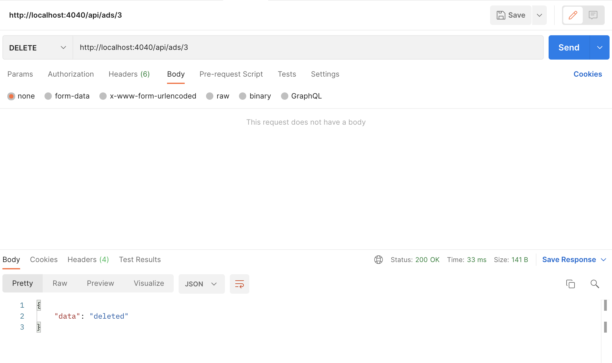

# OLX Women Workshop - Backend

# Requirements
- Go, version 1.17 or higher - https://go.dev/doc/install
- Postman (Desktop or web version) - https://www.postman.com/downloads/
- VS Code IDE - https://code.visualstudio.com with the following extensions:
  - GoLang extension: https://marketplace.visualstudio.com/items?itemName=golang.go
  - MySql extensions: 
    - SqlTools - https://marketplace.visualstudio.com/items?itemName=mtxr.sqltools
    - MySql driver - https://marketplace.visualstudio.com/items?itemName=mtxr.sqltools-driver-mysql
- Docker (Desktop for Mac/Windows, Engine for Linux) - https://www.docker.com/get-started

# Instructions
## 1. Design API endpoints
When developing an API, typically we begin by designing the endpoints. Here are the endpoints we will create in this tutorial:

**List adverts**
```
GET 'http://localhost:4040/api/ads'
```
**Create an advert**
```
POST 'http://localhost:4040/api/ads' \
--form 'title="Sofá cinzento 5"' \
--form 'description="Lorem Ipsum dasda"' \
--form 'price="350.5"' \
--form 'ad_image=@"/Users/isabelsantos/Pictures/91072971_3683624258330948_398133950691672064_n.jpeg"'
```
**Delete an advert**
```
DELETE 'http://localhost:4040/api/ads/{advert_id}'
```

## 2. Create project for the application
To begin, let’s create a project for the code you’ll write.
At the end of this workshop, our folder structure should be the following:
```sh
├── database
│   ├── connection.go
├── handlers
│   ├── advert.go
├── models
│   ├── advert.go
├── static
│   ├── images
├── .env
├── docker-compose.yml
├── go.mod
└── main.go
```
1. Open your terminal and change for a directory of your choice.
2. Create a directory for your code called `mini-olx-backend`. Then get inside the new folder.
```sh
mkdir mini-olx-backend

cd mini-olx-backend
```
3. We will be using the dependency management provided by Golang. 
Run the `go mod init` command and this will generate a `go.mod` file that saves the third-party libraries we require.
```sh
go mod init mini-olx-backend 
```
We will need certain packages to help us with our journey:
- **gorilla/mux** - To create routes and HTTP handlers for our endpoints 
- **go-sql-driver/mysql** - MYSQL driver.
- **joho/godotenv** - to load .env file variables
```sh
go get github.com/gorilla/mux
go get github.com/go-sql-driver/mysql
go get github.com/joho/godotenv
```
4. Open the project in VS Code.
5. In the root, create the `main.go` file that will be our entry point.
```go
package main

import "fmt"

func main() {
    fmt.Println("Hello World!")
}
```
6. Let’s compile and run our application. Go to your terminal and run the following:
```sh
    go run main.go
```

## 3. Database setup
Now we will create a database and add a table to persist our adverts' data.
1. In the root folder, create a new file called `docker-compose.yml` and add the following content:
```yaml
version: "3.2"
services:
  database:
    image: mysql:5.7.22
    environment:
      MYSQL_ROOT_PASSWORD: ""
      MYSQL_ALLOW_EMPTY_PASSWORD: 1
    container_name: mini-olx-backend-db
    ports:
      - 33061:3306
    volumes:
      - mini-olx-backend-data:/var/lib/mysql
volumes:
  mini-olx-backend-data:
```
2. Let's also create our `.env` file where we will define our ENV variables to connect to database:
```text
DB_HOST=127.0.0.1
DB_USER=root
DB_PASS=
DB_NAME=mini_olx
```
3. On the termina, execute the following command in order to set up our database system (remove the `-d` flag if you want to see the output):
```shell
docker-compose up -d
```
If you list the current containers running on your computer, you should see the below output:
```shell
docker ps
```
Outputs:
```shell
CONTAINER ID   IMAGE          COMMAND                  CREATED          STATUS          PORTS                               NAMES
9a0b170408d3   mysql:5.7.22   "docker-entrypoint.s…"   39 seconds ago   Up 36 seconds   0.0.0.0:33061->3306/tcp             mini-olx-backend-db
```
4. Now, let's set up our database from Docker. Using SQLTools on VSCode editor, open a new DB connection.





6. To create the database use the query below
```mysql
CREATE DATABASE mini_olx;
```
6. To start using the previously created database use the query below:
```mysql
USE mini_olx;
```
7. Once inside our database let’s create the table `advert` where we'll store all the information about the advert:
```mysql
CREATE TABLE advert (
    id INT AUTO_INCREMENT PRIMARY KEY,
    title VARCHAR(150) NOT NULL,
    description TEXT NOT NULL,
    price FLOAT not null,
    image_path VARCHAR(255) not null
);
```
8. Insert some data into the table:
```mysql
INSERT INTO advert (id, title, description, price, image_path)
VALUES (1, 'Pink sofa', 'A very beautiful sofa', 250, 'pink_sofa.jpg');
```
9. Now back to the project, let’s create our database package to manage and create connections to the database.

Create a folder name `database`. Inside the folder, create the `connection.go` file and add the following code:
```go
package database

import (
	"database/sql"
	"fmt"
	"log"
	"os"

	_ "github.com/go-sql-driver/mysql"
	_ "github.com/joho/godotenv/autoload"
)

var (
	dbConn *sql.DB
)

func CreateConn() *sql.DB {
	var err error

	user := os.Getenv("DB_USER")
	pass := os.Getenv("DB_PASS")
	host := os.Getenv("DB_HOST")
	name := os.Getenv("DB_NAME")

	credentials := fmt.Sprintf("%s:%s@(%s:33061)/%s?charset=utf8&parseTime=True", user, pass, host, name)
	dbConn, err = sql.Open("mysql", credentials)

	if err != nil {
		log.Fatal(err)
	} else {
		fmt.Println("Succeeded to connect to database")
	}

	return dbConn
}

func GetConn() *sql.DB {
	return dbConn
}
```
10. Then we will update the `main.go` file and call the function `CreateConn` to make the connection to database:
```diff
package main

+ import (
+ 	"mini-olx-backend/database"
+ )
- import "fmt"

func main() {
+     database.CreateConn()
-     fmt.Println("Hello World!")

}
```
11. Go to your terminal and run the application again. Now you should see the following output:
```shell
Succeeded to connect to database
```

## 4. Create the models
In this step we will create the package responsible to manage the data.
This package will contain Go structs that can be bounded to database objects and also the necessary queries to perform the actions.
1. Create a new folder called `models`.
2. Inside `models` folder, create `advert.go` file.
3. Let's start by creating our model by using go `struct` type:
```Go
package models

type Advert struct {
	Id          int     `json:"id"`
	Title       string  `json:"title"`
	Description string  `json:"description"`
	Price       float64 `json:"price"`
	Image       string  `json:"ad_image"`
}
```
3. With our database in place we now can define here all the interactions with the records of the `advert` table (LIST, CREATE and DELETE):
```diff
package models

+ import (
+ 	"mini-olx-backend/database"
+ )

type Advert struct {
	Id          int     `json:"id"`
	Title       string  `json:"title"`
	Description string  `json:"description"`
	Price       float64 `json:"price"`
	Image       string  `json:"ad_image"`
}


+ func List() ([]Advert, error) {
+ 	var adverts []Advert
+ 
+ 	statement, err := database.GetConn().Query(`SELECT * FROM advert ORDER BY id DESC`)
+ 	if err != nil {
+ 		return adverts, err
+ 	}
+ 
+ 	for statement.Next() {
+ 		advert := Advert{}
+ 
+ 		err = statement.Scan(&advert.Id, &advert.Title, &advert.Description, &advert.Price, &advert.Image)
+ 		if err != nil {
+ 			return adverts, err
+ 		}
+ 
+ 		adverts = append(adverts, advert)
+ 	}
+ 
+ 	return adverts, nil
+ }
+ 
+ func Create(advert Advert) (Advert, error) {
+ 	_, err := database.GetConn().Exec(
+ 		`INSERT INTO advert (title,description,price,image_path) VALUE (?,?,?,?)`,
+ 		advert.Title, advert.Description, advert.Price, advert.Image,
+ 	)
+ 
+ 	return advert, err
+ }
+ 
+ func Delete(advertID int) error {
+ 	_, err := database.GetConn().Exec(`DELETE FROM advert WHERE id = ?`, advertID)
+ 
+ 	return err
+ }
```
The code above sets up 3 methods that match each of our API endpoints:
- `List` will return all adverts from our table, sorted by ID, from highest to lowest.
- `Create` is responsible for creating a new advert in the database.
- `Delete` is responsible for deleting an advert from the database, by a given ID.

## 4. Handlers and Routes
Now we will create a simple server for handling our HTTP requests.
Here we will register three routes mapping URL paths to handlers to LIST, CREATE and DELETE adverts.
1. Let's update `.env` file with two more variables.
```diff
DB_HOST=127.0.0.1
DB_USER=root
DB_PASS=
DB_NAME=mini_olx
+ PORT=4040
+ IMAGE_PATH=http://localhost:4040
```
2. We will create our server in `main.go`file:
```diff
package main

import (
+	"log"
+	"net/http"
	"mini-olx-backend/database"
+	"os"
+
+	"github.com/gorilla/mux"
+	_ "github.com/joho/godotenv/autoload"
)

func main() {
    database.CreateConn()
    
+   router := mux.NewRouter()

+   err := http.ListenAndServe(":"+os.Getenv("PORT"), router)
+   if err != nil {
+       log.Fatal(err)
+   }

}
```
3. All our handlers will be in the `handlers` package. 
So now, let's create the folder handlers. Then create `advert.go`.
4. On `advert.go` file, let's start by creating the handler to list all the items.
```go
import (
    "encoding/json"
    "fmt"
    "net/http"
    "olx-women-workshop-2022-backend/models"
    "os"
    
    _ "github.com/joho/godotenv/autoload"
)

type Response struct {
    Err  string      `json:"error,omitempty"`
    Data interface{} `json:"data,omitempty"`
}

func List(w http.ResponseWriter, r *http.Request) {
    var res Response

    adverts, err := models.List()

    for i := range adverts {
        adverts[i].Image = fmt.Sprintf("%s/%s", os.Getenv("IMAGE_PATH"), adverts[i].Image)
    }

    if err != nil {
        res.Err = err.Error()
    } else {
        res.Data = adverts
    }

    w.Header().Set("Content-Type", "application/json")
    json.NewEncoder(w).Encode(res)
}
```
5. Now we need to register the route `GET: /api/ads` in our server defined in `main.go`:
```diff
package main

import (
    "log"
    "net/http"
    "os"

    "mini-olx-backend/database"

    "github.com/gorilla/mux"
    _ "github.com/joho/godotenv/autoload"
)


func main() {
    database.CreateConn()
    
    router := mux.NewRouter()
+    router.HandleFunc("/api/ads", handlers.List).Methods(http.MethodGet)
    
    err := http.ListenAndServe(":"+os.Getenv("PORT"), router)
    if err != nil {
        log.Fatal(err)
    }
}

```
6. Now going to Postman and doing the `GET: /api/ads` request, we should receive the following JSON response.


7. Let's continue by creating the CREATE handler. Back to `handlers > advert.go` file:
```diff
import (
    "encoding/json"
    "fmt"
    "net/http"
    "olx-women-workshop-2022-backend/models"
    "os"
    
    _ "github.com/joho/godotenv/autoload"
)


type Response struct {
    Err  string      `json:"error,omitempty"`
    Data interface{} `json:"data,omitempty"`
}


func List(w http.ResponseWriter, r *http.Request) {
    var res Response

    adverts, err := models.List()

    for i := range adverts {
        adverts[i].Image = fmt.Sprintf("%s/%s", os.Getenv("IMAGE_PATH"), adverts[i].Image)
    }

    if err != nil {
        res.Err = err.Error()
    } else {
        res.Data = adverts
    }

    w.Header().Set("Content-Type", "application/json")
    json.NewEncoder(w).Encode(res)
}


+ func Create(w http.ResponseWriter, r *http.Request) {
+    var err error
+    var res Respons 
+    newAdvert := models.Advert{
+        Title:       r.FormValue("title"),
+        Description: r.FormValue("description"),
+    
+    if s, err := strconv.ParseFloat(r.FormValue("price"), 64); err == nil {
+        newAdvert.Price = s
+    
+    newAdvert.Image, err = getFormFile(r)
+    if err != nil {
+        res.Err = err.Error()
+        w.Header().Set("Content-Type", "application/json")
+        json.NewEncoder(w).Encode(res)
+    
+    _, err = models.Create(newAdvert)
+    if err != nil {
+        res.Err = err.Error()
+    } else {
+        res.Data = "created"
+    
+    w.Header().Set("Content-Type", "application/json")
+    json.NewEncoder(w).Encode(res)
+ }
+ 
+ func getFormFile(r *http.Request) (string, error) {
+   r.ParseMultipartForm(10 << 20) // 10mb
+ 
+   file, _, err := r.FormFile("ad_image")
+   if err != nil {
+       return "", err
+   }
+   defer file.Close()
+ 
+   tempFile, err := ioutil.TempFile("static/images", "upload-*.png")
+   if err != nil {
+       return "", err
+   }
+   defer tempFile.Close()
+ 
+   fileBytes, err := ioutil.ReadAll(file)
+   if err != nil {
+       return "", err
+   }
+ 
+   _, err = tempFile.Write(fileBytes)
+   if err != nil {
+       return "", err
+   }
+ 
+   return tempFile.Name(), nil
+ }
```

8. We will need a folder to store the uploaded images.
As we can see in the above code, the images will be stored in the `static/images` folder path, so let's add it to our folder structure.

9. Then let's also register the route `POST: /api/ads` in our server defined in `main.go`:
```diff
package main

import (
	"log"
	"net/http"
	"mini-olx-backend/database"
+	 "mini-olx-backend/handlers"
	"os"

	"github.com/gorilla/mux"
	_ "github.com/joho/godotenv/autoload"
)


func main() {
    database.CreateConn()
    
    router := mux.NewRouter()
    router.HandleFunc("/api/ads", handlers.List).Methods(http.MethodGet)
+    router.HandleFunc("/api/ads", handlers.List).Methods(http.MethodPost)
    
    err := http.ListenAndServe(":"+os.Getenv("PORT"), router)
	if err != nil {
        log.Fatal(err)
    }  
}

```
10. We will need to add a special route in order to have our server not only returning json content, but also images.
For this we will use FileServer that returns a handler that serves HTTP requests with the contents of the file system:
```diff
package main

import (
	"log"
	"net/http"
	"mini-olx-backend/database"
	"mini-olx-backend/handlers"
	"os"

	"github.com/gorilla/mux"
	_ "github.com/joho/godotenv/autoload"
)


func main() {
    database.CreateConn()
    
    router := mux.NewRouter()
    router.HandleFunc("/api/ads", handlers.List).Methods(http.MethodGet)
    router.HandleFunc("/api/ads", handlers.List).Methods(http.MethodPost)

+    router.
+        PathPrefix("/static/").
+        Handler(http.StripPrefix("/", http.FileServer(http.Dir("./static/"))))
    
    err := http.ListenAndServe(":"+os.Getenv("PORT"), router)
	if err != nil {
        log.Fatal(err)
    }  
}
```
11. Now going to Postman and doing the `POST: /api/ads/` request, we should receive the following JSON response.


12. And now let's create the last handler to DELETE an advert. Back to `handlers > advert.go` file:
```diff
import (
    "encoding/json"
    "fmt"
    "net/http"
    "olx-women-workshop-2022-backend/models"
    "os"
    
    _ "github.com/joho/godotenv/autoload"
)


type Response struct {
    Err  string      `json:"error,omitempty"`
    Data interface{} `json:"data,omitempty"`
}


func List(w http.ResponseWriter, r *http.Request) {
    var res Response

    adverts, err := models.List()

    for i := range adverts {
        adverts[i].Image = fmt.Sprintf("%s/%s", os.Getenv("IMAGE_PATH"), adverts[i].Image)
    }

    if err != nil {
        res.Err = err.Error()
    } else {
        res.Data = adverts
    }

    w.Header().Set("Content-Type", "application/json")
    json.NewEncoder(w).Encode(res)
}


func Create(w http.ResponseWriter, r *http.Request) {
    var err error
    var res Response
    
    newAdvert := models.Advert{
        Title:       r.FormValue("title"),
        Description: r.FormValue("description"),
    }
    
    if s, err := strconv.ParseFloat(r.FormValue("price"), 64); err == nil {
        newAdvert.Price = s
    }
    
    newAdvert.Image, err = getFormFile(r)
    if err != nil {
        res.Err = err.Error()
        w.Header().Set("Content-Type", "application/json")
        json.NewEncoder(w).Encode(res)
    }
    
    _, err = models.Create(newAdvert)
    if err != nil {
        res.Err = err.Error()
    } else {
        res.Data = "created"
    }
    
    w.Header().Set("Content-Type", "application/json")
    json.NewEncoder(w).Encode(res)
}


+ func Delete(w http.ResponseWriter, r *http.Request) {
+ 	vars := mux.Vars(r)
+ 	id, _ := strconv.Atoi(vars["id"])
+ 
+ 	err := models.Delete(id)
+ 
+ 	res := Response{}
+ 	if err != nil {
+ 		res.Err = err.Error()
+ 	} else {
+ 		res.Data = "deleted"
+ 	}
+ 
+ 	w.Header().Set("Content-Type", "application/json")
+ 	json.NewEncoder(w).Encode(res)
+ }

func getFormFile(r *http.Request) (string, error) {
   r.ParseMultipartForm(10 << 20) // 10mb
 
   file, _, err := r.FormFile("ad_image")
   if err != nil {
       return "", err
   }
   defer file.Close()
 
   tempFile, err := ioutil.TempFile("static/images", "upload-*.png")
   if err != nil {
       return "", err
   }
   defer tempFile.Close()
 
   fileBytes, err := ioutil.ReadAll(file)
   if err != nil {
       return "", err
   }
 
   _, err = tempFile.Write(fileBytes)
   if err != nil {
       return "", err
   }
 
   return tempFile.Name(), nil
}

```

13. Register the route `DELETE: /api/ads/:id` in our server defined in `main.go`:
```diff
package main

import (
	"log"
	"net/http"
	"mini-olx-backend/database"
	"mini-olx-backend/handlers"
	"os"

	"github.com/gorilla/mux"
	_ "github.com/joho/godotenv/autoload"
)


func main() {
    database.CreateConn()
    
    router := mux.NewRouter()
    router.HandleFunc("/api/ads", handlers.List).Methods(http.MethodGet)
    router.HandleFunc("/api/ads", handlers.List).Methods(http.MethodPost)
+    router.HandleFunc("/api/ads/:id", handlers.List).Methods(http.MethodDelete)
    
    router.
        PathPrefix("/static/").
        Handler(http.StripPrefix("/", http.FileServer(http.Dir("./static/"))))

    err := http.ListenAndServe(":"+os.Getenv("PORT"), router)
	if err != nil {
        log.Fatal(err)
    }  
}
```

14. Going back to Postman and doing the `DELETE: /api/ads/:id` request, we should receive the following JSON response.


## 5. Put it all together
Now that we have our API working as expected let's put our frontend application communicating with our newly API. 
In order to proceed, we will use a docker image of the application done in the latest workshop.
1. Let's update our `docker-compose.yml` file as following:
```diff
version: "3.2"
services:
+  frontend:
+    image: aipms/olx-women-workshop-2022-frontend:v1
+    ports:
+      - 3000:3000
+    container_name: mini-olx-frontend
  database:
    image: mysql:5.7.22
    environment:
      MYSQL_ROOT_PASSWORD: ""
      MYSQL_ALLOW_EMPTY_PASSWORD: 1
    container_name: mini-olx-backend-db
    ports:
      - 33061:3306
    volumes:
      - mini-olx-backend-data:/var/lib/mysql
volumes:
  mini-olx-backend-data:
```
Run `docker-compose up -d`

Go to your favorite browser and open the following url http://localhost:3000

2. Our frontend application in http://localhost:3000 is doing a request to a different domain http://localhost:4040.
We need to enable CORS to allow this communication. For this we need to add some special headers to our requests on backend side.
On `main.go` file let's add the following to our routes:
```diff
package main

import (
	"log"
	"net/http"
	"mini-olx-backend/database"
	"mini-olx-backend/handlers"
	"os"

	"github.com/gorilla/mux"
	_ "github.com/joho/godotenv/autoload"
)


func main() {
    database.CreateConn()
    
    router := mux.NewRouter()
    router.HandleFunc("/api/ads", handlers.List).Methods(http.MethodGet)
    router.HandleFunc("/api/ads", handlers.List).Methods(http.MethodPost)
    router.HandleFunc("/api/ads/:id", handlers.List).Methods(http.MethodDelete)

    router.
        PathPrefix("/static/").
        Handler(http.StripPrefix("/", http.FileServer(http.Dir("./static/"))))
    
+   allowedMethods := []string{
+       http.MethodGet,
+       http.MethodPost,
+       http.MethodDelete,
+       http.MethodPatch,
+       http.MethodOptions,
+   }
+
+   handler := cors.
+       New(cors.Options{AllowedMethods: allowedMethods}).
+       Handler(router)
+
+   err := http.ListenAndServe(":"+os.Getenv("PORT"), handler)
-   err := http.ListenAndServe(":"+os.Getenv("PORT"), router)
	if err != nil {
        log.Fatal(err)
    }  
}

```

4. Enjoy your mini-olx :)
